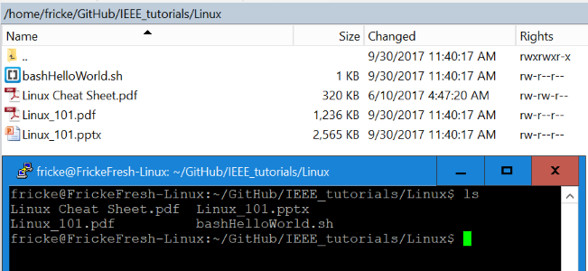
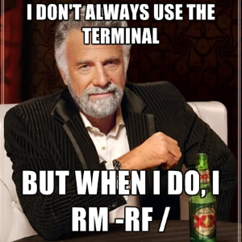

# Linux Workshop Guide

This workshop is broken into sections. Feel free to skip sections, but I would suggestion anyone new to go through them all in order

- [Before You Start](#before-you-start)
	- [Linux Users](#linux-users)
- [Logging In](#logging-in)
	- [Windows](#windows)
	- [Macs](#macs)
- [Getting Around](#getting-around)
- [File Fun](#file-fun)
- [Editing](#editing)
- [Bash Scripts](#bash-scripts)
  
## Before You Start

* Note you don't need to know any programming to do this Linux workshop, so don't be freaked out
* **WARNING** DO NOT copy and paste the Linux command
	1. It's good practice to type and know the commands
	2. sometimes the `"` and `'` in windows can be different than linux, so your commands don't work

#### Linux Users

Every linux machine will have users log in with a username and computer hostname or ip address

- **Example:**
	- **Username** - `pi`
	- **Computer Hostname** - `raspberrypi`
	- 

## Logging In

All Engineering students can log into the CAE Linux computers with their CAE accounts. If you have a CS account you can also log into the CS computers with your CS account

### Windows

1. Quick [download Putty](https://the.earth.li/~sgtatham/putty/latest/w32/putty.exe)
2. Run the `putty.exe` file
	- 
3. Type in the correct user and hostname
	- **CAE Computers**: `YOURUSERNAME@best-tux.cae.wisc.edu`
		- example: `sjfricke@best-tux.cae.wisc.edu` for the username `sjfricke`
	- **CS Computers**: `YOURUSERNAME@best-linux.cs.wisc.edu`
		- example: `fricke@best-linux.cs.wisc.edu` for the username `fricke`

### Macs

1. Open the Terminal program on the Macs
2. run the `ssh` command to log into the account
	- **CAE Computers**: `ssh YOURUSERNAME@best-tux.cae.wisc.edu`
		- example: `ssh sjfricke@best-tux.cae.wisc.edu` for the username `sjfricke`
	- **CS Computers**: `ssh YOURUSERNAME@best-linux.cs.wisc.edu`
		- example: `ssh fricke@best-linux.cs.wisc.edu` for the username `fricke`
3. If it ask about "ECDSA key fingerprint" enter `yes`
4. Type password
	- **NOTE** the password will not show up when you type, but be assure its being typed in

## Getting Around

Before we start moving around in the terminal I want you to realize that the files in the terminal are the **same** thing as the files in your file explorer GUI

1. To see what folder you are in run the command `pwd`
	- 
2. To see the contents of the folder run the `ls` command
3. Now we will add a **flag**. Try running `ls -l`
	- The `-l` flag is used to *list one file per line*
4. Run `ls --help` to see all the other options possible
	
5. Let's now change folders/directories now, for this guide we will use the `Document` folder
	- **NOTE:** feel free to use any folder you want, just replace the word `Document` in the follow examples
6. To *change directory* run the command `cd Document`
	- Note since it's in the current folder we could also run `cd ./Document`
7. Run both `ls` and `pwd` to see your status of that folder
8. To go back up to the parent directory run `cd ../`
9. Let's go all the way to the root folder with `cd /`
	- Run both `ls` and `pwd` to see your status of that folder
10. To get back run `cd ~`
11. Play around with moving around folders with `cd`, `ls` and `pwd` and when ready move to next sections

## File Fun

We are going to now have fun making, copying, and deleting some files and folders. Note that not all folders will have permissions for you to read, write, or delete files.

**NOTE:** If you ever mess up a command you can just type `Ctrl + c` and it will cancel the command

1. Start by running `cd ~` to get to your home directory
2. To make a new folders/directory called `workshop` we will run `mkdir workshop`
3. Run `ls` and verify you see the `workshop` folder
4. Run `cd workshop` to move into the folder
5. To make an empty file we will run `touch myFirstFile.txt`
	- Run `ls` to see the new file
6. To add some text into the file run `echo "Linux is so fun" >> myFirstFile.txt`
	- `echo` will print/echo back things back to the command line*
	- `>>` is used to append to a file
	- This command printed text and instead of echoing it back we wrote it into the file
7. To see the content of your file you can use the `cat` command to display the contents of a file. Run `cat myFirstFile.txt`
	- **BIG NOTE:** you should be using "tab complete"
	- Type `cat my` and then press the *TAB* key
	- The "tab complete" will check all the items in the current folder and if there is only one that fits the current letters it will just complete the rest of the word for you
8. To make a copy of the file we need to use the `cp` command and give it a **source** to copy and a **destination** where to put it. Run `cp myFirstFile.txt copiedFile.txt`
	- Run `ls` and `cat copiedFile.txt` to see you made a copy
9. Let's make another subfolder called `memes` by running `mkdir memes`
	- Run `ls -l` to see the new folder
10. We want to move the `copiedFile.txt` into the `memes` folder. The move command `mv` works the same as the copy command. To move the file and rename it run `mv copiedFile.txt memes/movedFile.txt`
11. Run both `ls` and `ls memes/` to see the file
12. Type `ls m` and than hit *TAB* twice. This is what happens when "tab complete" has more then one option, it will display them all if you press *TAB* twice.
	- You can type the next letter of one of the option and hit *TAB* again to finish the "tab complete"
13. To see the content you can either change directories the run `cat` or just run `cat memes/movedFile.txt`
14. To delete the file we will run the remove command, but first:
	- 
15. First we will remove the `movedFile.txt` by running `rm memes/movedFile.txt`. If it asks you to confirm just enter `y`
	- if you add the flag `-f` it will *force* the removing which will prevent it from asking you to confirm.
16. To delete the folder we need to add the `-r` flag which stands for *recursive*. We also want to force delete so we want to add the flag `-f`. Instead of going `-r -f` we can combine them together by going `-rf` which will run both flags.
17. Run `rm -rf memes/` and check to see the folder is deleted
18. Once again, to warn you of the power of delete and that to be careful to run `rm` **ESPECIALLY** if you are the root user
	- 

## Editing

So I would **HIGHLY** advise learning a "real" text editor such as Vim or Emacs, but for sake of time we will use Nano for its ease and simplicity.

> Nano 101

- `^` means CTRL key
- `M` means ALT key
- 
	- so `^X` means `CTRL + x` will *exit* the nano text editor

1. Lets create a new file by running `nano listOfNames.txt`
2. List 5-10 names all on new lines
3. Type `^X`  ( Ctrl + x ) to exit
4. Nano will ask to save, type `y`
	- 
5. You can change the filename to save it as, if you want to just keep it press *ENTER*
	- 

## Bash Scripts

Bash scripts are powerful scripts that run commands for you in the Bash terminal that you most likely are using as your terminal